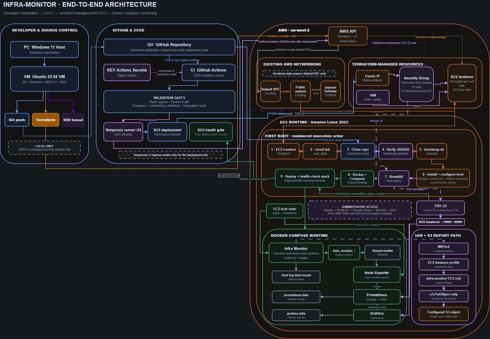
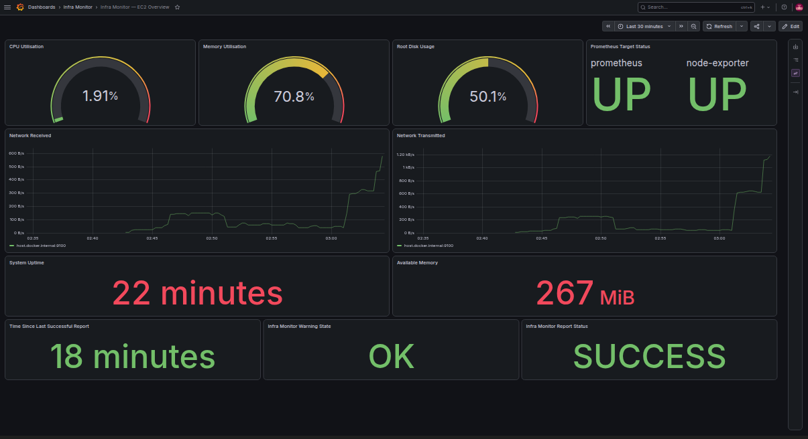

# Infra Monitor

> A reproducible AWS-hosted Linux monitoring platform with infrastructure as code, containerised observability and health-gated CI/CD deployment.

`infra-monitor` began as a Bash system-report script and evolved into a complete cloud monitoring and automation platform.

Terraform provisions the AWS infrastructure, cloud-init bootstraps a fresh EC2 host, Docker Compose runs the application and monitoring services, and GitHub Actions validates, tests and deploys every change. Node Exporter, Prometheus and Grafana provide host and application observability.

**Core stack:** `Linux` · `Bash` · `AWS` · `Terraform` · `Docker Compose` · `GitHub Actions` · `Prometheus` · `Grafana` · `IAM`

- **Status:** Core engineering complete — preparing the `v1.0.0` portfolio release
- **Verification:** [Final technical audit passed](docs/final-verification.md)

## Explore the Project

- [View the architecture](#architecture)
- [Understand the monitoring stack](#monitoring-stack)
- [Review the security model](#security-model)
- [Inspect the CI/CD pipeline](#cicd-pipeline)
- [Review the Terraform infrastructure](#terraform-infrastructure)
- [Run the project locally](#running-locally)
- [View the project structure](#project-structure)
- [Read the final verification](docs/final-verification.md)

## What This Demonstrates

- **Reproducible infrastructure:** Terraform manages EC2, its Security Group, Elastic IP, IAM resources, encrypted root storage and bootstrap configuration.
- **Deterministic first boot:** Cloud-init clones the repository, verifies `bootstrap.sh` against its Terraform-planned SHA256 and automatically configures a fresh host.
- **Host-aware container monitoring:** The restricted Bash workload reports the EC2 host rather than only its container environment.
- **Integrated observability:** Node Exporter, custom `infra_monitor_*` metrics, Prometheus and an 11-panel provisioned Grafana dashboard expose host and application health.
- **Health-gated CI/CD:** GitHub Actions validates Bash, builds Docker, checks Compose and monitoring configuration, runs integration tests, deploys to EC2 and verifies health.
- **Least-privilege AWS access:** The application uses temporary IAM-role credentials through IMDSv2 and receives only `s3:PutObject` access to its configured report object.
- **Restricted network exposure:** SSH ingress is limited to trusted `/32` sources, monitoring ports remain private and dashboards are accessed through an SSH tunnel.
- **Failure and recovery engineering:** Container recreation, target failure, EC2 reboot, fresh-instance replacement, bootstrap idempotency and persistence were deliberately tested.

## Architecture

[](docs/architecture_diagram.png)

The architecture diagram shows the separate infrastructure, deployment, bootstrap, monitoring, storage and IAM permission flows. Select the image to view it at full resolution.

### End-to-End Operation

1. **Provisioning:** Terraform runs from the Ubuntu control VM, reads the existing default VPC and uses the AWS API to manage the Security Group, Elastic IP, EC2 instance, encrypted root storage, IAM resources and rendered user data.

2. **First boot:** When EC2 is created, cloud-init runs the rendered user-data launcher. It installs the minimum Git and checksum dependencies, clones the repository, verifies `bootstrap.sh` against the SHA256 calculated during the Terraform plan and only then executes it.

3. **Host configuration:** The version-controlled bootstrap configures `firewalld`, installs pinned Docker Buildx and Compose plugins, creates ignored runtime configuration, generates Grafana credentials and deploys the complete Compose stack.

4. **Continuous delivery:** A push to `main` triggers GitHub Actions. The workflow validates Bash, builds the image, validates Compose and monitoring configuration, runs the integration stack and deploys the exact tested commit to EC2 through temporary SSH access.

5. **Observability:** The one-shot Bash workload examines the EC2 host and publishes custom metrics through a shared textfile volume. Node Exporter exposes those metrics alongside native Linux metrics, Prometheus scrapes and stores them, and Grafana visualises the resulting time series.

6. **Secure operation:** AWS Security Groups and host-level `firewalld` prevent public monitoring access. Grafana and Prometheus are reached through an authenticated SSH tunnel, while the application obtains temporary S3 permissions from its EC2 IAM role through IMDSv2.

---

## Main Components

| Component                    | Responsibility                                                    |
| ---------------------------- | ----------------------------------------------------------------- |
| `system_report.sh`           | Generates host health reports, logs and custom Prometheus metrics |
| Docker                       | Packages the Bash application and its runtime dependencies        |
| Docker Compose               | Runs the application and monitoring stack                         |
| Node Exporter                | Exposes Linux host metrics and custom textfile metrics            |
| Prometheus                   | Scrapes, stores and queries time-series metrics                   |
| Grafana                      | Visualises system and application health                          |
| Terraform                    | Defines and rebuilds the AWS infrastructure                       |
| IAM                          | Gives the EC2 workload limited S3 access without stored AWS keys  |
| GitHub Actions               | Validates, tests and deploys changes                              |
| `bootstrap.sh`               | Configures a newly created EC2 instance automatically             |
| `monitoring_health_check.sh` | Verifies the deployed monitoring stack end-to-end                 |

---

## The Infra Monitor Application

The original project is still at the centre of the stack.

`scripts/system_report.sh` reports:

```text
CPU information
uptime and load
memory usage
host root-disk usage
top memory-consuming processes
host network interfaces
threshold status
```

The application runs as a **one-shot container workload**.

A successful run finishes with exit code `0`, so seeing:

```text
infra-monitor-compose    Exited (0)
```

is expected.

The other monitoring services remain running continuously.

The container intentionally observes the Linux host using host UTS, PID and network namespaces plus a read-only host-root mount.

At the same time, the container is restricted using:

```text
read-only container root filesystem
no-new-privileges
all Linux capabilities dropped
read-only host-root mount
```

It doesn't run with `privileged: true`.

---

## Monitoring Stack

The main monitoring flow is:

```text
Linux EC2 host
      ↓
Node Exporter
      ↓
Prometheus
      ↓
Grafana
```

The Bash application also feeds its own state into the same system:

```text
system_report.sh
      ↓
infra_monitor.prom
      ↓
Node Exporter textfile collector
      ↓
Prometheus
      ↓
Grafana
```

Custom metrics include:

```text
infra_monitor_last_run_timestamp_seconds
infra_monitor_last_success_timestamp_seconds
infra_monitor_cpu_warning
infra_monitor_memory_warning
infra_monitor_disk_warning
infra_monitor_overall_warning
infra_monitor_report_success
```

These are two complementary monitoring paths.

Node Exporter continuously exposes standard Linux metrics such as CPU, memory, filesystem, network and uptime information. The Bash application supplies project-specific state that Node Exporter would not understand by itself, including report success, threshold warnings and the timestamp of the most recent successful report.

`scripts/system_report.sh` writes the metrics to a temporary file and then moves it into place as `infra_monitor.prom`. This prevents the textfile collector from reading a partially written metrics file.

The shared `node-exporter-textfiles` volume connects the one-shot application to the continuously running Node Exporter service. This allows the Bash application to publish Prometheus metrics without becoming a permanent HTTP service.

Prometheus then scrapes Node Exporter, stores the resulting time series in `prometheus-data`, and supplies the data queried by the provisioned Grafana dashboard.

---

## Grafana Dashboard

The main provisioned dashboard is:

**Infra Monitor — EC2 Overview**

It currently contains 11 panels covering:

* CPU utilisation
* Memory utilisation
* Root disk usage
* Available memory
* Network receive traffic
* Network transmit traffic
* System uptime
* Prometheus target status
* Time since the last successful report
* Infra Monitor warning state
* Infra Monitor report status



The dashboard and Prometheus data source are stored as version-controlled provisioning files, so the important Grafana configuration can be reconstructed on a fresh server rather than depending only on an existing Grafana database.

---

## Security Model

### Network Access

Permanent public monitoring ingress is not required.

The Terraform-managed Security Group restricts SSH to the configured trusted `/32` CIDR.

The EC2 host also runs `firewalld`.

Public monitoring access remains blocked for:

```text
3000 — Grafana
9090 — Prometheus
9100 — Node Exporter
```

Grafana and Prometheus are accessed through authenticated SSH local port forwarding instead.

### EC2 Hardening

Terraform explicitly configures:

```text
IMDSv2 required
metadata hop limit = 2
encrypted gp3 root EBS
IAM instance profile
stable Elastic IP
user-data replacement when bootstrap changes
```

### Secrets and Runtime Configuration

Safe example configuration is tracked:

```text
docker/runtime.env.example
```

Real runtime configuration is ignored:

```text
docker/runtime.env
```

Grafana credentials live outside the repository:

```text
~/.config/infra-monitor/grafana.env
```

The EC2 private key also remains outside the repository:

```text
~/ssh/infra-monitor-key.pem
```

Terraform state, real `.tfvars`, runtime `.env` files, private keys and logs are ignored by Git.

---

## IAM Least Privilege

The EC2 workload uses a Terraform-managed IAM role rather than stored AWS access keys.

The application's current AWS requirement is deliberately narrow:

```text
Action:
s3:PutObject

Resource:
configured system-report object
```

Testing confirmed that the workload can upload the intended report while unrelated operations such as bucket listing, uploading to another key and calling EC2 APIs are denied.

---

## CI/CD Pipeline

The GitHub Actions pipeline is triggered by pushes to `main` and can also be run manually.

```text
Bash Syntax Checks
        ↓
Docker Build Check
        ↓
Docker Compose / Prometheus / Grafana Validation
        ↓
Monitoring Integration Checks
        ↓
Deploy To EC2
        ↓
Post-Deployment Health Checks
```

CI verifies:

```text
Bash syntax
required container commands
Docker image build
Docker Compose configuration
host-aware report behaviour
Prometheus configuration
Grafana dashboard JSON and expected panels
full monitoring integration
custom Prometheus metrics
```

For deployment, GitHub Actions temporarily authorises the current runner's public `/32` on SSH port `22`.

The workflow deploys the exact Git commit that passed the current CI run rather than blindly deploying whatever happens to be newest on `main`.

Conceptually:

```text
GitHub Actions
    ↓
current workflow commit SHA
    ↓
fetch repository objects
    ↓
reset EC2 checkout to exact tested SHA
    ↓
scripts/deploy-infra-monitor.sh
```

The deployment script verifies that the tracked checkout is clean and, when a deployment commit is supplied, confirms that HEAD matches the requested commit before deploying.

Workflow concurrency also cancels an older in-progress main pipeline when a newer run supersedes it, preventing competing deployments to the same EC2 host.

The temporary runner SSH rule is removed afterwards.

The jobs form a dependency chain, so deployment cannot start unless every earlier validation and integration stage succeeds.

Deploying the workflow commit SHA prevents a race where `main` changes after validation and the server accidentally receives code that was never tested by that run.

An SSH connection succeeding is not treated as a successful deployment by itself. The remote deployment script rebuilds the stack and runs `monitoring_health_check.sh`. Its exit status returns to GitHub Actions and gates the final job.

The health gate verifies the one-shot application result, service reachability, Prometheus configuration and readiness, scrape targets, custom metrics and Grafana database health. A failed service therefore produces a failed deployment rather than a misleading green workflow.

---

## EC2 Bootstrap

A fresh EC2 instance does not require manual application preparation.

Bootstrapping is split into two layers.

`terraform/user_data.sh.tftpl` is the small first-boot launcher. It installs the minimum dependencies, obtains the repository and verifies the planned `bootstrap.sh` checksum.

`terraform/bootstrap.sh` contains the larger, version-controlled host configuration process. It handles operating-system packages, the firewall, pinned Docker tooling, runtime files, credentials, Docker Compose deployment, IAM verification and monitoring health.

This separation keeps EC2 user data small while allowing the main bootstrap logic to be reviewed and versioned normally. The SHA256 check also binds the executed bootstrap to the content expected by Terraform; if the repository contains a different bootstrap, first boot stops instead of executing unverified instructions.

Terraform renders a small user-data launcher that:

```text
clones the repository
        ↓
verifies bootstrap.sh SHA256
        ↓
executes bootstrap.sh
```

The hardened bootstrap then:

```text
installs host dependencies
        ↓
configures firewalld
        ↓
installs pinned Docker tooling
        ↓
creates runtime configuration
        ↓
generates Grafana credentials
        ↓
deploys Docker Compose
        ↓
checks IAM access
        ↓
runs monitoring health checks
```

The bootstrap was tested by replacing the existing EC2 instance through Terraform.

The EC2 instance ID changed while the Elastic IP remained stable, and the replacement server reconstructed the stack automatically.

The bootstrap was also rerun to test idempotency and the new EC2 instance was rebooted to verify recovery.

---

## Running Locally

The intended local development environment is Linux.

This project was developed from an Ubuntu 22.04 VM.

Clone the repository:

```bash
git clone https://github.com/DevAryX/infra-monitor.git
cd infra-monitor
```

Create the local runtime configuration:

```bash
cp docker/runtime.env.example docker/runtime.env
chmod 600 docker/runtime.env
```

Create local Grafana credentials:

```bash
mkdir -p ~/.config/infra-monitor
chmod 700 ~/.config/infra-monitor

{
  echo 'GF_SECURITY_ADMIN_USER=admin'
  printf 'GF_SECURITY_ADMIN_PASSWORD=%s\n' "$(openssl rand -hex 24)"
} > ~/.config/infra-monitor/grafana.env

chmod 600 ~/.config/infra-monitor/grafana.env
```

Build and start the stack:

```bash
docker compose \
  -f docker/docker-compose.yml \
  up -d --build
```

Check all services:

```bash
docker compose \
  -f docker/docker-compose.yml \
  ps -a
```

Run the reusable health checker:

```bash
bash scripts/monitoring_health_check.sh
```

Local interfaces:

```text
Grafana:    http://localhost:3000
Prometheus: http://localhost:9090
Node Exporter metrics: http://localhost:9100/metrics
```

---

## Secure Access to EC2 Monitoring

The EC2 monitoring interfaces are not opened publicly.

Get the stable deployment host:

```bash
EC2_HOST="$(
  cd terraform \
  && terraform output -raw deployment_host
)"
```

Create an SSH tunnel from the Ubuntu VM:

```bash
ssh \
  -i ~/ssh/infra-monitor-key.pem \
  -N \
  -T \
  -o ExitOnForwardFailure=yes \
  -L 127.0.0.1:13000:127.0.0.1:3000 \
  -L 127.0.0.1:19090:127.0.0.1:9090 \
  ec2-user@"$EC2_HOST"
```

Then access:

```text
EC2 Grafana:    http://localhost:13000
EC2 Prometheus: http://localhost:19090
```

The different local ports allow the Ubuntu VM's own monitoring stack to continue using `3000` and `9090`.

---

## Terraform Infrastructure

Terraform runs from the Ubuntu control VM and communicates with the AWS API. It is not executed inside EC2 and is separate from the normal GitHub Actions application deployment.

The configuration has the following responsibilities:

| Responsibility | Implementation |
| --- | --- |
| Existing network discovery | Reads the AWS default VPC through a Terraform data source |
| Compute | Creates the Amazon Linux 2023 EC2 instance |
| Machine image | Resolves the current Amazon Linux 2023 AMI through AWS Systems Manager Parameter Store |
| Network access | Creates the Security Group and restricts permanent SSH ingress to the configured trusted `/32` |
| Stable addressing | Creates and associates an Elastic IP used by SSH and deployment |
| Storage | Creates an encrypted 8 GiB gp3 root volume |
| Workload identity | Creates the IAM role, least-privilege policy and EC2 instance profile |
| Bootstrap | Renders EC2 user data with the repository, branch, S3 configuration and expected bootstrap SHA256 |
| Metadata security | Requires IMDSv2 and configures the container-compatible metadata hop limit |
| Automation outputs | Exposes the instance, deployment host, Security Group and IAM information needed for operation |

A meaningful user-data change can replace the EC2 instance because:

```
user_data_replace_on_change = true
```

This makes bootstrap behaviour part of the reproducible infrastructure lifecycle.

The Elastic IP is managed separately from the EC2 instance, so the underlying server can be replaced while the deployment address remains stable.

The AMI is resolved dynamically when infrastructure is created, while the lifecycle configuration avoids replacing a healthy instance merely because AWS later publishes a newer image.

Typical workflow:

```
cd terraform

terraform init
terraform fmt
terraform validate
terraform plan
terraform apply
```

`terraform plan` is reviewed before applying because changes to EC2 user data can intentionally cause instance replacement.

Operational outputs include the deployment host, SSH command, instance ID, Security Group ID, Elastic IP, IAM role, instance profile and S3 policy ARN.

See `terraform/README.md` for the complete infrastructure workflow and safety notes.

---

## Project Structure

```text
infra-monitor/
├── .github/
│   └── workflows/
│       └── test.yml
│
├── docker/
│   ├── Dockerfile
│   ├── docker-compose.yml
│   ├── runtime.env.example
│   └── README.md
│
├── docs/
│   ├── README.md
│   ├── project-retrospective.md
│   ├── APR-cloud-docs.md
│   ├── MAY-terraform-notes.md
│   ├── JUN-docker-notes.md
│   ├── JUL-cicd-notes.md
│   ├── AUG-monitoring-security-docs.md
│   ├── aug-bootstrap-hardening.md
│   ├── architecture_diagram.png
│   ├── bootstrap-notes.md
│   ├── cloud-notes.md
│   ├── cost-notes.md
│   ├── ec2-startup-notes.md
│   ├── git-notes.md
│   ├── log-notes.md
│   ├── final-verification.md
│   ├── networking-notes.md
│   └── yaml-notes.md
│
├── monitoring/
│   ├── grafana/
│   │   ├── dashboards/
│   │   │   └── infra-overview.json
│   │   ├── provisioning/
│   │   │   ├── dashboards/
│   │   │   │   └── dashboards.yml
│   │   │   └── datasources/
│   │   │       └── prometheus.yml
│   │   └── dashboard-notes.md
│   │
│   ├── prometheus/
│   │   ├── prometheus.yml
│   │   └── promql-basics.md
│   │
│   ├── ec2-deployment-test.md
│   ├── iam-least-privilege.md
│   ├── persistence-test.md
│   └── README.md
│
├── proof/
│   ├── feb_imgs/
│   ├── mar_imgs/
│   ├── apr_imgs/
│   ├── may_imgs/
│   ├── jun_imgs/
│   ├── jul_imgs/
│   ├── aug_imgs/
│   └── sept_imgs/
│
├── scripts/
│   ├── deploy-infra-monitor.sh
│   ├── monitoring_health_check.sh
│   ├── resource_check.sh
│   └── system_report.sh
│
├── terraform/
│   ├── .terraform.lock.hcl
│   ├── bootstrap.sh
│   ├── iam.tf
│   ├── main.tf
│   ├── outputs.tf
│   ├── terraform.tfvars.example
│   ├── user_data.sh.tftpl
│   ├── variables.tf
│   └── README.md
│
├── logs/                         # generated locally, ignored by Git
├── .dockerignore
├── .env.example                 # earlier/direct-script configuration example
├── .gitignore
└── README.md
```

---

## Failure and Recovery Testing

The project was tested beyond the normal healthy state.

Testing included:

```text
Node Exporter failure
Prometheus detecting target DOWN
Node Exporter recovery
Grafana container recreation
Grafana provisioning recovery
Prometheus container recreation
Prometheus volume persistence
EC2 reboot
fresh EC2 replacement
bootstrap idempotency
firewall persistence
IAM role access
S3 upload
public-port blocking
CI/CD deployment health
```

This was important because infrastructure is more convincing when failures are deliberately introduced and recovery can be explained.

---

## Project Evolution

| Phase          | Main Focus                                            |
| -------------- | ----------------------------------------------------- |
| February 2026  | Git, GitHub and Bash foundations                      |
| March 2026     | EC2, cron, logging and S3                             |
| April 2026     | Networking, security, logging and cost awareness      |
| May 2026       | Terraform Infrastructure as Code                      |
| June 2026      | Docker and Docker Compose                             |
| July 2026      | GitHub Actions CI/CD                                  |
| August 2026    | Prometheus, Grafana, custom metrics, IAM and security |
| Post-August    | EC2 bootstrap and runtime hardening                   |
| September 2026 | Final documentation and portfolio polish              |

The core project is now complete.

---

## What I Learned

This project gave me practical experience with:

* Linux and Bash scripting
* Failure handling and structured logging
* AWS EC2, S3, IAM and VPC networking
* Security Groups and host firewalls
* Terraform and infrastructure lifecycle management
* Docker images and Docker Compose
* Host-aware container monitoring
* Git and deployment checkout management
* GitHub Actions CI/CD
* Prometheus metrics and PromQL
* Node Exporter and the textfile collector
* Grafana dashboards and provisioning
* IAM roles and least-privilege policies
* Runtime secret/configuration separation
* Health checks and deployment gates
* Failure and recovery testing
* Idempotent bootstrap design
* Reproducible/disposable infrastructure

---

## Documentation

More detailed learning notes and verification are stored throughout the repository.

The month-by-month files preserve the project's development history and may describe earlier architecture. The main README and component guides document the current system.

Useful starting points:

* [`docs/README.md`](docs/README.md) — documentation map and source-of-truth guide
* [`Project retrospective`](project-retrospective.md) — development journey, lessons, limitations and future improvements
* [`docs/AUG-monitoring-security-docs.md`](docs/AUG-monitoring-security-docs.md)
* [`docs/aug-bootstrap-hardening.md`](docs/aug-bootstrap-hardening.md)
* [`monitoring/README.md`](monitoring/README.md)
* [`monitoring/ec2-deployment-test.md`](monitoring/ec2-deployment-test.md)
* [`monitoring/iam-least-privilege.md`](monitoring/iam-least-privilege.md)
* [`monitoring/persistence-test.md`](monitoring/persistence-test.md)
* [`monitoring/prometheus/promql-basics.md`](monitoring/prometheus/promql-basics.md)
* [`monitoring/grafana/dashboard-notes.md`](monitoring/grafana/dashboard-notes.md)
* [`docker/README.md`](docker/README.md)
* [`terraform/README.md`](terraform/README.md)

Proof screenshots from each phase are stored under:

```text
proof/
```

---

## Project Status

**Core project complete — September 2026.**

The original goal was to take a simple Linux monitoring script and progressively build real infrastructure, deployment, observability and security around it.

Alhumdulillah, that goal has been completed.

Future changes, if any, are optional extensions rather than missing core functionality.

Possible future areas could include remote Terraform state, AWS OIDC for GitHub Actions, Alertmanager, centralised logs or a larger orchestration platform, but none are required for the current project to be considered complete.

---

## Author

GitHub: https://github.com/DevAryX
