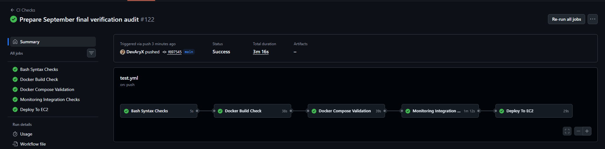
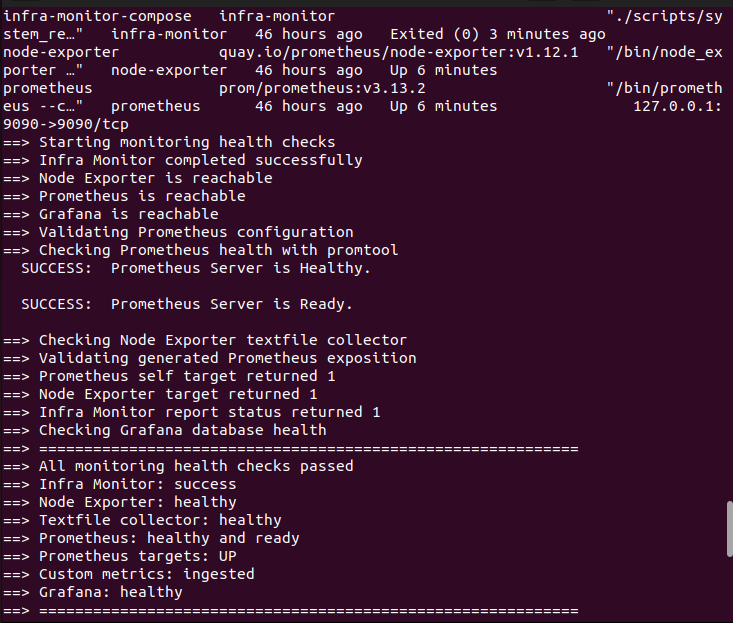

# Final Verification

- Audit date: 2 September 2026
- Branch: `main`
- Audit commit: `f697545`
- Overall result: Passed

## Purpose

This audit verified that `infra-monitor` remained functional, deployable, observable and appropriately protected before its final portfolio release.

## v1.0.0 Release Gate

**Release reference:** `v1.0.0`  
**Verification date:** 2026-09-02

The final portfolio release passed the following checks:

- Local Git working tree clean
- Git object integrity check passed
- Bash syntax checks passed
- Docker Compose configuration validated
- Terraform formatting and validation passed
- Terraform reported no infrastructure changes
- EC2 monitoring health check passed before reboot
- EC2 reboot recovery completed successfully
- `firewalld` recovered after reboot
- Infra Monitor completed with exit code `0`
- Node Exporter and Prometheus targets reported healthy
- Custom `infra_monitor_*` metrics were ingested
- Grafana database health reported `ok`
- Public monitoring ports `3000`, `9090` and `9100` remained blocked
- SSH port `22` remained restricted
- Repository secret and sensitive-file checks passed
- Final GitHub Actions validation and deployment completed successfully

### Release Evidence

- [End-to-end architecture](architecture_diagram.png)
- [Final Grafana dashboard](../proof/aug_imgs/day16-final-ec2-dashboard.png)
- [Terraform no-change verification](../proof/sept_imgs/day8-terraform-no-changes.png)
- [EC2 reboot health verification](../proof/sept_imgs/day8-reboot-health-check.png)

Fresh-instance replacement, automated bootstrap, idempotency and recovery had already been tested during bootstrap hardening.

The release gate therefore verified the finished infrastructure without performing another unnecessary EC2 replacement.

## Local Validation

The following checks passed from the Ubuntu 22.04 control VM:

- Git working tree hygiene
- Bash syntax validation
- Terraform formatting and validation
- Docker image build
- Docker Compose configuration validation
- Prometheus configuration validation
- Grafana dashboard JSON validation
- Complete local monitoring health check

The local Compose stack reached its expected state. The one-shot Infra Monitor container exited successfully with code `0`, while Node Exporter, Prometheus and Grafana remained running.

## CI/CD Verification

The GitHub Actions `CI Checks` workflow passed:

1. Bash Syntax Checks
2. Docker Build Check
3. Docker Compose Validation
4. Monitoring Integration Checks
5. Deploy To EC2

The deployment job deployed the audited commit to EC2 and completed its post-deployment health verification.

## EC2 and Monitoring Verification

The EC2 deployment checkout was clean and matched the expected Git commit.

The deployed stack reported:

- Infra Monitor completed successfully
- Node Exporter healthy
- Node Exporter textfile collector healthy
- Prometheus healthy and ready
- Prometheus targets up
- Custom `infra_monitor_*` metrics ingested
- Grafana database healthy

## IAM Verification

`aws sts get-caller-identity` succeeded from inside the Infra Monitor application container.

This confirmed that the container could obtain temporary AWS credentials through the Terraform-managed EC2 IAM role. No long-lived workload AWS keys were required.

The earlier positive and negative least-privilege tests remain documented in [`../monitoring/iam-least-privilege.md`](../monitoring/iam-least-privilege.md).

## Security Verification

- No real runtime environment files or private keys were tracked by Git
- No obvious AWS access-key or private-key material was found in tracked text files
- Runtime configuration, Grafana credentials and the SSH private key used restrictive file permissions
- The SSH private key remained outside the repository
- `firewalld` was active on EC2
- SSH remained permitted through the host firewall
- Ports `3000`, `9090` and `9100` were absent from the public firewalld zone
- External connection attempts to the three monitoring ports were blocked

Grafana and Prometheus therefore remain accessible through authenticated SSH tunnelling rather than permanent public ingress.

## Evidence

## Conclusion

`infra-monitor` passed its final technical verification and is ready for portfolio use.

The v1.0.0 core project is complete. Any future changes are optional extensions rather than missing release requirements.
